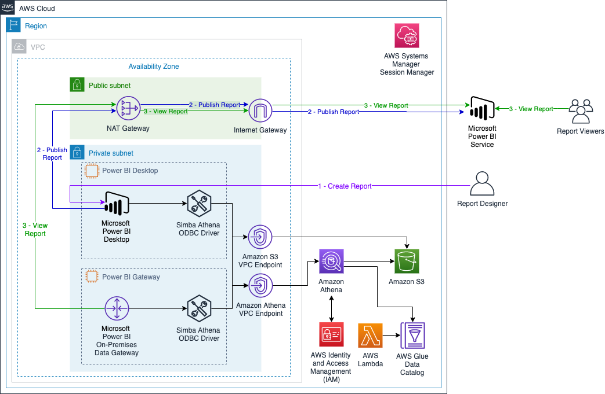
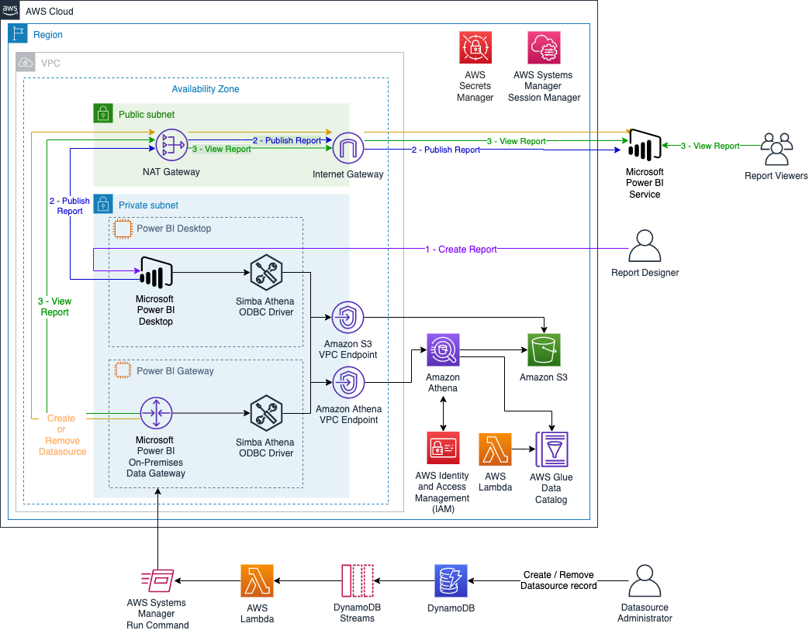

## Amazon Athena data source connector for Power BI

The repo provides reference architecture to create Microsoft Power BI dashboards using [Amazon Athena](https://aws.amazon.com/athena/) with Microsoft Power BI DirectQuery enabled.

You can create reports and dashboards using a built in, Microsoft-certified connector for Athena. AWS customers using Power BI for business intelligence can leverage their Amazon S3 data lake and [federated data sources](https://docs.aws.amazon.com/athena/latest/ug/connect-to-a-data-source.html) to analyze, visualize, and share insights with Power BI.

To enable analysis at scale, the connector supports [Power BI DirectQuery](https://docs.microsoft.com/power-bi/connect-data/desktop-use-directquery) to query only the necessary data and can produce faster loading visualizations. You can also choose to import the full dataset if appropriate for your analysis. After publishing content to the Power BI service, you can keep it up to date through on-demand or scheduled refreshes using the July release of Power BI Gateway.

The Athena connector for Power BI uses your existing ODBC driver configuration to query Athena. To download the latest ODBC driver, refer to the [Athena documentation](https://docs.aws.amazon.com/athena/latest/ug/connect-with-odbc.html) and see [Using the Amazon Athena Power BI Connector](https://docs.aws.amazon.com/athena/latest/ug/connect-with-odbc-and-power-bi.html) for more information. 

### Deployment options: 

| Configuration | AWS Blog | Architecture | Details | Cloudformation Stack |
| ------ | -------| --- |------ | --- |
| Manual | [Creating dashboards quickly on Microsoft Power BI using Amazon Athena](aws_athena_blog_1) |   | Deploy and manually configure all the required infrastructure to create Microsoft Power BI dashboards using Athena with Microsoft Power BI DirectQuery enabled.|  |
| Automation | [How ENGIE automates the deployment of Amazon Athena data sources on Microsoft Power BI](aws_athena_blog_2) |   | Deploy all the required infrastructure and automate the creation/configuration of the Athena connections on Microsoft Power BI Gateway and Microsoft Power BI Online to create  dashboards using Athena.|  |

## Reporting Bugs
If you encounter a bug, please create a new issue with as much detail as possible and steps for reproducing the bug. See the [Contributing Guidelines](CONTRIBUTING.md#security-issue-notifications) for more details.

## License

This sample code is licensed under the MIT-0 License. See the [LICENSE](LICENSE) file.

